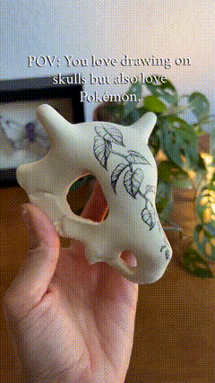
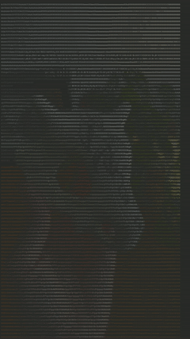

A Go tool that converts videos and photos into ASCII art — preview it live in your terminal or export it as an MP4/PNG file.

<p align="center">
  <table>
    <tr>
      <td align="center"><b>Original</b></td>
      <td align="center"><b>ASCII Output</b></td>
    </tr>
    <tr>
      <td></td>
      <td></td>
    </tr>
  </table>
</p>

---

## Overview

**Video to ASCII** takes any `.mp4` video or `.jpg`/`.png` photo and recreates it using ASCII characters. You can preview the result directly in the terminal or export it as a rendered MP4 (H.264) or PNG image. Output files are saved to your **Downloads** directory, named after the original file with an `_Ascii` suffix — e.g. `cat.mp4` → `cat_Ascii.mp4`.

**NOTE** some videos will not look that great in ascii due to the colours / background, please test the options to see what pleases you more. 

### Pipeline

```
Input media (mp4/jpg/png)
       │
       ▼
┌──────────────┐
│  ffmpeg-go   │ ->  Extract frames at chosen resolution & FPS
└──────┬───────┘
       │
       ▼
┌──────────────┐
│  ansiart     │ ->  Render each frame as ASCII with ANSI true color
└──────┬───────┘
       │
       ▼
┌──────────────┐
│  fogleman/gg │ -> Draw ASCII onto PNG canvas (with contrast boost)
└──────┬───────┘
       │
       ▼
┌──────────────┐
│  ffmpeg-go   │ -> Encode PNG frames back into MP4 (H.264 / yuv420p)
└──────────────┘
       │
       ▼
 ~/Downloads/<original>_Ascii.mp4 (or .png)
```

## Features

- **Video & photo support** — `.mp4`, `.jpg`, `.png` inputs
- **Colorful or black & white** ASCII modes
- **Background color options** — black, gray, or white
- **Adjustable resolution** — 720p, 480p, or 360p
- **Adjustable FPS** — 30, 20, or 10
- **Live terminal preview** — plays the ASCII animation frame-by-frame
- **Dark color boost** — lifts dark pixel colors so characters stay visible against any background
- **Smart output naming** — exports to `~/Downloads/<original_name>_Ascii.mp4` or `.png`

## Requirements

| Dependency | Minimum version | Notes |
|------------|-----------------|-------|
| [Go](https://go.dev/dl/) | 1.21+ | Uses built-in `max()`. Developed on 1.26 |
| [ffmpeg](https://ffmpeg.org/download.html) | 4.0+ | Must be in your `PATH` |

### Installing ffmpeg

**Windows** (PowerShell via Winget):
```powershell
winget install ffmpeg
```

Or via [Chocolatey](https://chocolatey.org/):
```powershell
choco install ffmpeg
```

**Linux** (Debian/Ubuntu):
```bash
sudo apt install ffmpeg
```

**Linux** (Arch):
```bash
sudo pacman -S ffmpeg
```

**macOS** (Homebrew):
```bash
brew install ffmpeg
```

Verify with:
```bash
ffmpeg -version
```

## How to Run It

### 1. Clone the repository

```bash
git clone https://github.com/BrunoGzr/video-to-ascii.git
cd video-to-ascii
```

### 2. Build

```bash
go build -o video-to-ascii .
```

On Windows you'll get `video-to-ascii.exe`.

### 3. Run

```bash
./video-to-ascii
```

On Windows:
```powershell
.\video-to-ascii.exe
```

### 4. Follow the interactive menu

```
=========================================
==           VIDEO TO ASCII           ==
=========================================

Main Menu
+----------------------------------------+
| 1  - Select Media (Video/Photo)        |
| 2  - Select Resolution                 |
| 3  - Convert to ASCII                  |
| 4  - Preview ASCII                     |
| 5  - Export (MP4/PNG)                  |
| 6  - Exit                              |
+----------------------------------------+

> 
```

**Step 1 — Select Media:** Choose video or photo, set FPS (videos only), enter the path to your file, pick color mode and background color.

**Step 2 — Select Resolution:** 720p for quality, 480p for balance, 360p for speed.

**Step 3 — Convert to ASCII:** Processes the media into ASCII frames.

**Step 4 — Preview ASCII:** Plays the result in the terminal (videos) or prints the image (photos).

**Step 5 — Export:** Saves the output to `~/Downloads/<original_name>_Ascii.mp4` (video) or `~/Downloads/<original_name>_Ascii.png` (photo).

**Step 6 — Exit.**

## Project Structure

```
video-to-ascii/
├── main.go       # Entry point + interactive CLI menu logic
├── extract.go    # ffmpeg frame extraction (video & photo modes)
├── ascii.go      # ANSI ASCII conversion via ansiart
├── render.go     # PNG rendering, ANSI color parsing, contrast boost
├── export.go     # MP4/PNG encoding + Downloads path resolution
├── menu.go       # Settings struct, presets, terminal UI helpers
├── go.mod
├── go.sum
└── README.md
```

## Dependencies

| Package | Why |
|---------|-----|
| [u2takey/ffmpeg-go](https://github.com/u2takey/ffmpeg-go) | Go bindings for ffmpeg — frame extraction and MP4 encoding |
| [Zebbeni/ansiart](https://github.com/Zebbeni/ansiart) | Converts images into ANSI-colored ASCII art |
| [fogleman/gg](https://github.com/fogleman/gg) | 2D graphics — draws ASCII text onto PNG frames |

## Roadmap

- [ ] **Concurrency** — process frames in parallel with goroutines for faster conversion
- [ ] **Custom ASCII character sets** — let the user choose density gradients (e.g. blocks, binary, custom strings)
- [ ] **GIF export** — support `.gif` output in addition to MP4
- [ ] **CLI flags** — add non-interactive mode: `video-to-ascii --input cat.mp4 --res 480p --color --out cat_ascii.mp4`
- [ ] **Web-based preview** — serve a local page that renders the ASCII in the browser
- [ ] **Adjustable ASCII grid size** — let users define custom column/row counts beyond presets

## License

MIT — see [LICENSE](LICENSE).

## Author

**Bruno** — [@BrunoGzr](https://github.com/BrunoGzr)

## Acknowledgments

This project was built primarily through hands-on programming by the author as a learning exercise in Go. AI assistance was used during development to help with code refactoring, debugging edge cases, and writing documentation.
